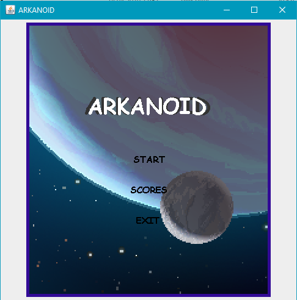

# Arkanoid

## Table of contents
* [General info](#general-info)
* [Technologies](#technologies)
* [Status](#status)
* [Example](#example)
* [Graphics sources](#graphics-sources)

## General info
This is a university project developed in Java. It's a simple game that utilizes Java Swing library.
	
## Technologies
Java
	
## Status
In progress

## Example

## Graphics sources
http://rebloggy.com/post/space-galaxy-pixel-art-pixel-spiral-galaxy/107710286152#tooltip-107710286152
https://co.pinterest.com/el_ferry/pixel-art/
